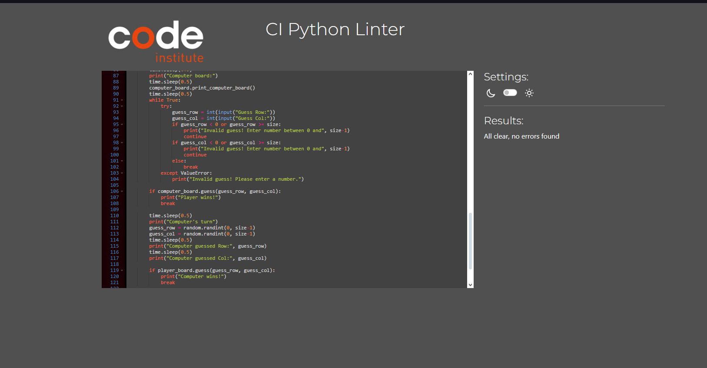

# pyShips
pyShips is a rendition of the game battleships made in python. You play against the computer and whoever is first to sink the opponents ships wins.
## How to play
When you first start the game it will ask you to what board size you want to play on. 
After you have made your choice the game will start. It will ask you to guess a row and then a column, to do this you just write down a number. The game will then tell you if you sank a ship or not and the computer will make its guess. When all the sinks have been sunk the game will end and it will ask you if you wanna play again. For yes you write Y and for no you write N.
## Features
### Existing features
- Different Board sizes 
    - You can choose different board sizes 
    
- Random board generation
    - The game randomly places a set amount of ships on your board depending on the board size. 5 on 5x5, 10 on 10x10 and 15 on 15x15 
    - Your ships are marked with an S
    
    
    
- Dynamic board
    - Whenever you make a guess the board updates itself to show you where you have guessed. If you land a hit on a ship the character changes to an X and if you miss it becomes a * sign. If you guess the same spot another time nothing changes with the board but the game will tell you that you already guessed that spot and then go to the computers turn.
    
    
    

- Playing againts the computer
- Maintaining the score on the board
- Input validation and error checking
    - You cannot make a different choice of board than the 3 that are availible
    
    - The game prevents you from entering a guess outside the board.
    
    - You must enter a number
    

### Future features
- Local coop
## Data model
I used a main class called board for this game.
The board stores size, guessed locations and ships during each game and then resets after it.
When the game is started it creates to different boards and prints them out using the print_player_board and print_computer_board function.
I also have a guess function for making a guess which handles what happens when you make your guess.
The main function which runs the game is called play_game
## Testing 
### Bugs
#### Solved bugs
- Getting syntax errors when entering an invalid guess.
- Different board states not getting printed out
#### Reamaining bugs
None
### Validator testing
- The code was tested using [CI Python Linter](https://pep8ci.herokuapp.com) where it found no errors
    - 
## Deployment
This project was deployed using the Code Insitute´s mock terminal for Heroku.
- Steps for deployment
    - Fork or clone this repository
    - Create a new heroku app
    - Set the buildbacks to Python and NodeJS in that order
    - Link the Heroku app to the repository
    - Click on <strong>Deploy</strong>

## Credits
- Code institute for the deployment terminal
- Milton Bradley and wikipedia for information regarding the battleship game